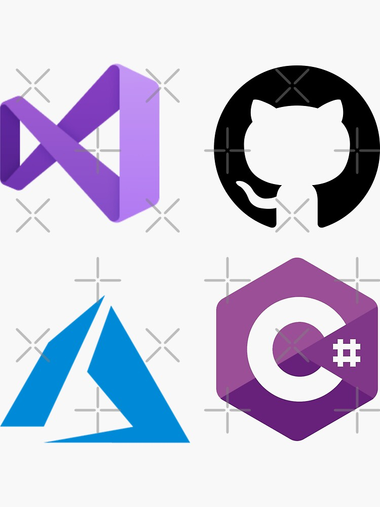

   

### Hi there Welcome to my Github Page👋👋

I am a .Net FullStack Developer working Professional at Nagarro
---

Frontend Technolgies- React, TypeScript, Javascript, Angular 9, Html5, CSS/SCSS, BootStrap  
Backend TechStack- C#, C++, C, Java, NodeJs    
Framework- ASP.NET, ASP.NET MVC, .NET Framework   
Database- SQL Server, NoSql, Mysql, MongoDB, FireBase/FireStore   
Operating System- Windows, Linux   
APIs- Rest WEB API/SOAP   
Project Management Tools & Methodologies- JIRA and Rally & Agile and Scrum.
Testing- NUnit, Jmeter, Cypress, Jest(Js Testing), React Testing Library(RTL)   

And I also a good Competitive Programmer and having strong knowledge of Data Structures and Algorithms, Computer Networking and I have a field of interest in Computer Vision, Artificial Intelligence, Programming languages and Formal Methods.   

Programming Handle-
1. LeetCode- https://leetcode.com/tomarshubham1357/   
2. GeeksForGeeks- https://auth.geeksforgeeks.org/user/tomarshabh2199/practice/  
3. CodeChef- https://www.codechef.com/users/tomarshubham   
4. HackerRank- https://www.hackerrank.com/tomarshabh2199   
5. HackerEarth- https://www.hackerearth.com/@tomarshabh2199   
6. InterViewBit- https://www.interviewbit.com/profile/tomarshubham13573787   

Social Media Handle  
Instagram-   
Discord-   
Telegram-   

---

Here are some ideas to get you started:

- 🔭 I’m currently working on ... Nagarro
- 🌱 I’m currently learning ... Data Structures and Algorithms
- 👯 I’m looking to collaborate on ... Microsoft Technologies
- 🤔 I’m looking for help with ... Software Development
- 💬 Ask me about ...Anything you want
- 📫 How to reach me: ...https://www.linkedin.com/in/shubham-tomar-536283157/
- 😄 Pronouns: ... He/Him
- ⚡ Fun fact: ... Software Engineer || Competitive Programmer
---
### Send me a message!
I am open for collaborations, so if you find my work interesting feel free to send me a message! Even if you don't send me a message anyway! Here is Where you can find me:

  

  
### Github Stats 

<!-- -->
<!-- -->

